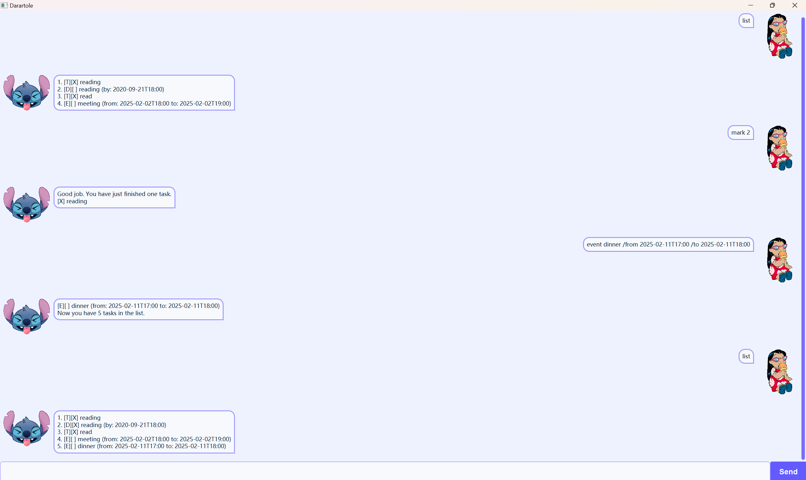

# Tarartole User Guide



Chatbot Tartartole is a **task tracking** application that implements a range of commands. 
The user can *add* tasks, *delete* tasks, *find* tasks, *mark* tasks and *unmark* tasks throughout the use journey. It helps the user better manage their tasks in the form of task list. 


## Adding tasks

Tasks are divided into three types: Todo, Deadline and Event. The user can add any of these 3 tasks into the tasklist.
- The command needed to add Todo is "todo [description]".
- The command needed to add Deadline is "deadline [description] /by YYYY-mm-ddTHH:mm".
- The command needed to add Event is "event [description] /from YYYY-mm-ddTHH:mm /to YYYY-mm-ddTHH:mm".

Example: `todo reading`

```
1. [T][ ] reading
```

## Listing all tasks

This feature enables the user to see all the tasks in the task list.

Example: `list`

```
1. [T][ ] reading
2. [D][X] returning books (by: 2025-02-11T18:00)
```


## Marking and unmarking tasks

The user can mark or unmark the specific task to indicate whether the task has been finished. The command should include the task number that the user would like to mark or unmark.

Example: `mark 1`

```
Good job. You have finished one task.
[X] reading
```


## Deleting tasks

The user can easily delete the task from the task list. 

Example: `delete 2`

```
I have removed the task for you. Now you have 1 task in the list.
```

## Finding tasks

The user can input any keywords of the task they would like to look for. Tarartole will return the tasks whose description matches the keywords.

Example: `find reading`

``` 
Here are the matching tasks in the list: 1. [T][X] reading
```

## Help 

The user can input "help" to get all the available commands.